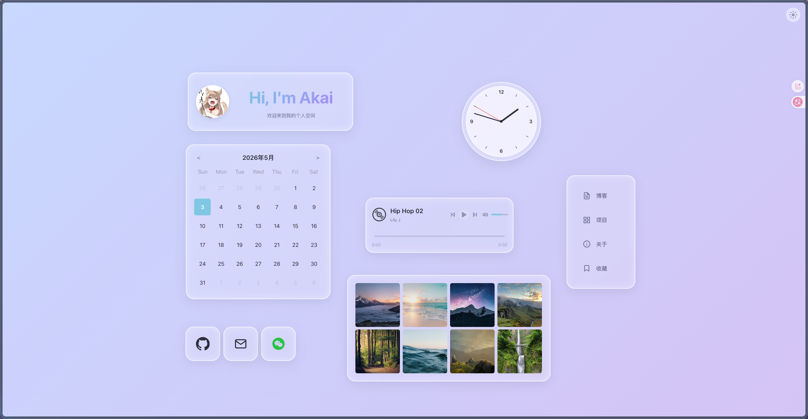

# Akai's Blog

基于 Vue 3 + TypeScript 的个人博客网站，毛玻璃（Glassmorphism）设计风格，支持拖拽布局、3D 悬浮效果、音乐播放、图片画廊等功能。

## 技术栈

- **框架**：Vue 3 + TypeScript + Vue Router
- **构建**：Vite
- **样式**：SCSS，毛玻璃设计系统
- **依赖**：marked（Markdown 渲染）、DOMPurify（XSS 防护）

## 页面预览

| 首页 | 项目列表 | 项目详情 |
|:----:|:--------:|:--------:|
|  |  |  |

## 功能特性

- **毛玻璃设计** — 半透明玻璃卡片、模糊背景、柔和阴影
- **3D 悬浮效果** — 鼠标跟随视角倾斜，`perspective()` + `rotateX/Y()`
- **像素级拖拽布局** — Pointer Events + 直接 DOM 操作，拖拽松手后保存偏移量到 localStorage
- **FLIP 导航动画** — 点击导航项后卡片从原位过渡到右上角浮动图标栏
- **音乐播放器** — 支持播放/暂停、切歌、进度条拖拽
- **图片画廊** — 缩略图网格，点击放大预览并附带 3D 倾斜效果
- **Markdown 博客** — 通过 `marked` 渲染，支持代码高亮、表格、TOC 目录导航
- **项目展示** — 从 GitHub API 构建时拉取仓库信息与 README，本地静态加载
- **响应式组件** — 日历、问候卡片、邮箱/微信快捷复制

## 快速开始

```bash
npm install
npm run dev      # 开发模式 http://localhost:5173
npm run build    # 生产构建
npm run preview  # 预览构建产物
```

### 拉取最新项目数据

```bash
GITHUB_TOKEN=your_token node tools/fetch-projects.mjs
```

会自动抓取 GitHub 仓库名称、描述、README 及引用图片，保存到 `public/projects-data/`。

## 部署

项目通过 GitHub Actions 自动部署到 GitHub Pages：

1. 推送 `main` 分支
2. GitHub Actions 自动执行构建
3. 发布到 `https://llsetnow.github.io/Blog/`

## 项目结构

```
src/
├── components/
│   ├── common/        # 通用组件（Toast）
│   ├── home/          # 首页组件（问候卡、时钟、音乐、画廊等）
│   └── layout/        # 布局组件（AppLayout）
├── composables/       # 组合式函数（布局编辑器、GitHub API）
├── data/              # 静态数据（音乐列表）
├── styles/            # 全局样式（变量、毛玻璃 mixin）
├── views/             # 页面（首页、博客、项目、关于、收藏）
└── router/            # 路由配置
```

## 许可

MIT
